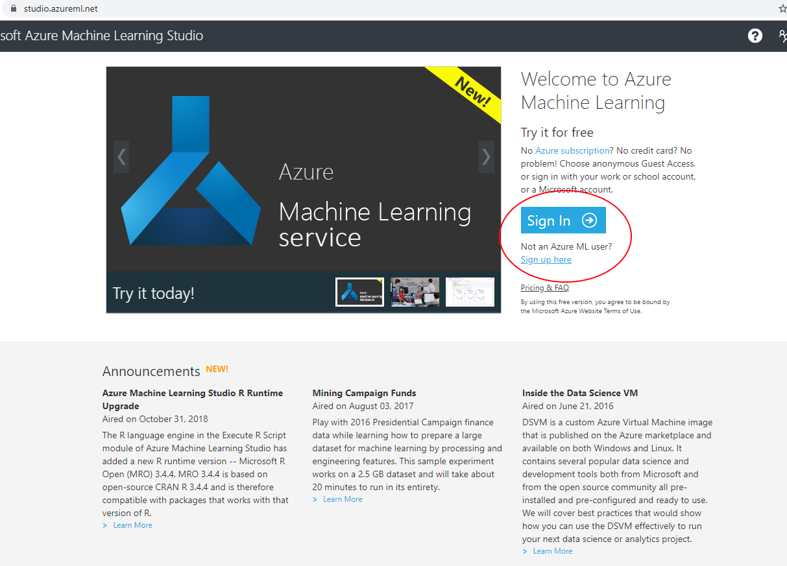
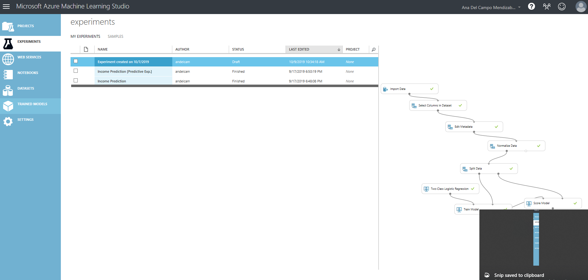

# Predictive Analytics for Business Analysts - Lab 1

## Learning Objectives

	• Establishing access to the cloud service, navigating the screens, reviewing and summarizing data. 
	• Designing and training a linear model, interpreting the output 
	
## Tasks
1. Establishing access to the cloud service
1. Navigating the screens
1. Reviewing and summarizing data
1. Designing and training a linear model
1. Interpreting the output 

### Task 1: Establishing access to the cloud service

Navigate to [Azure Machine Learning Studio](https://studio.azureml.net/)

Main Screen

