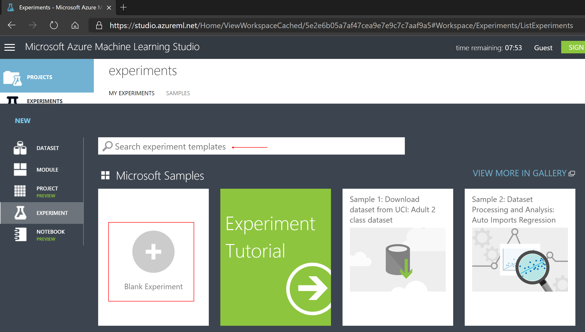
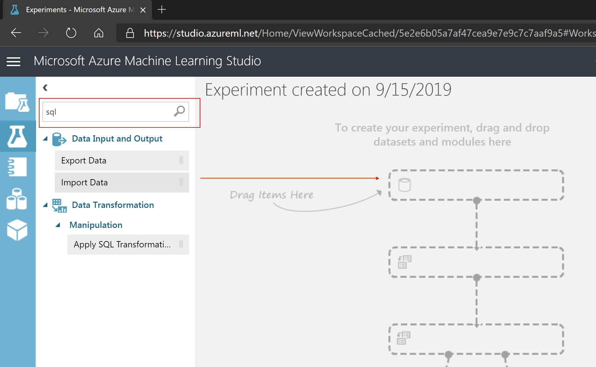
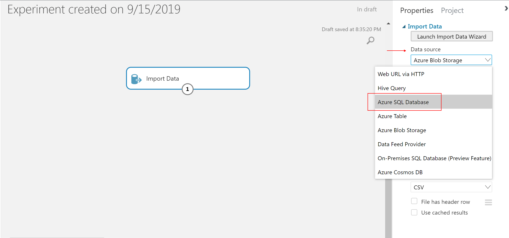
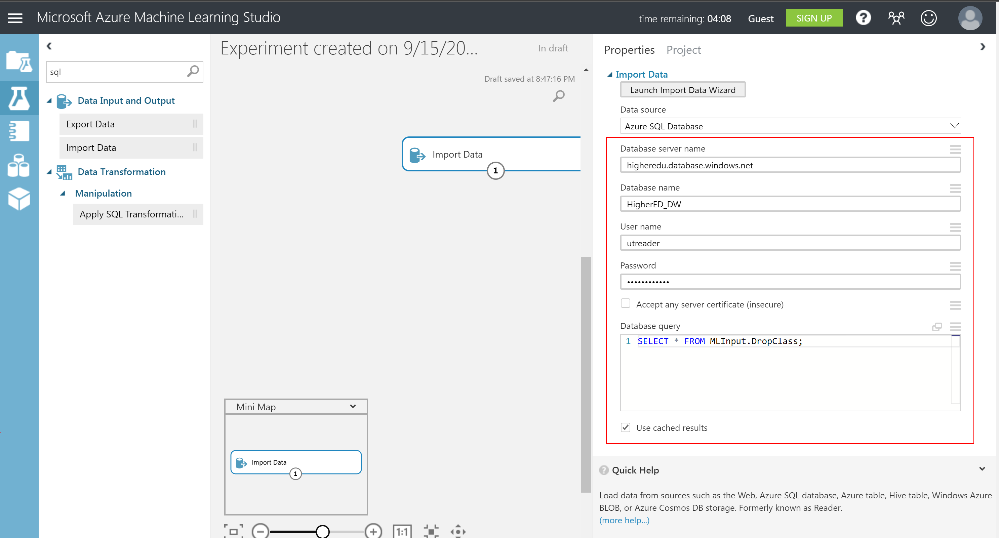
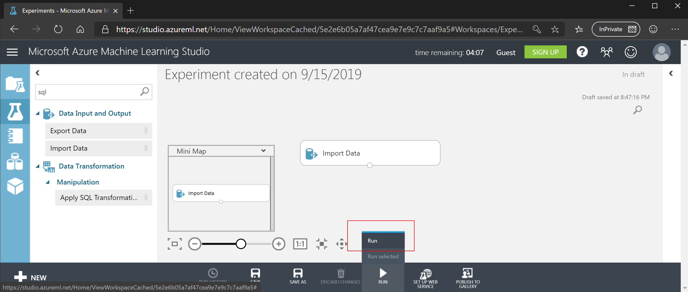
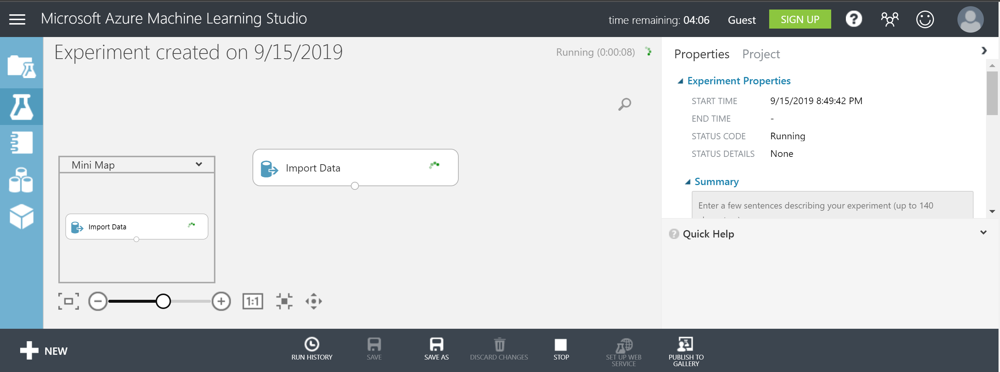
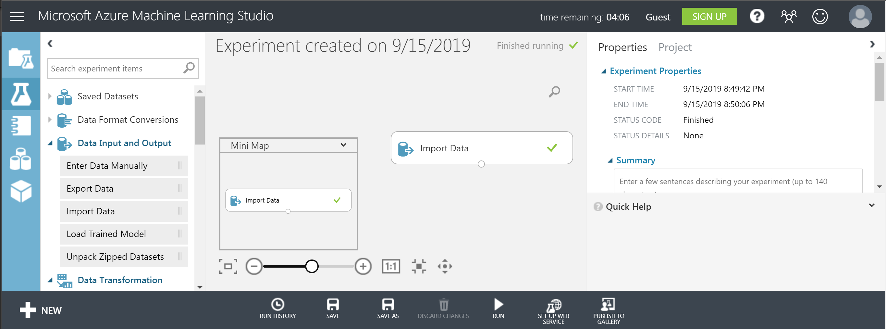
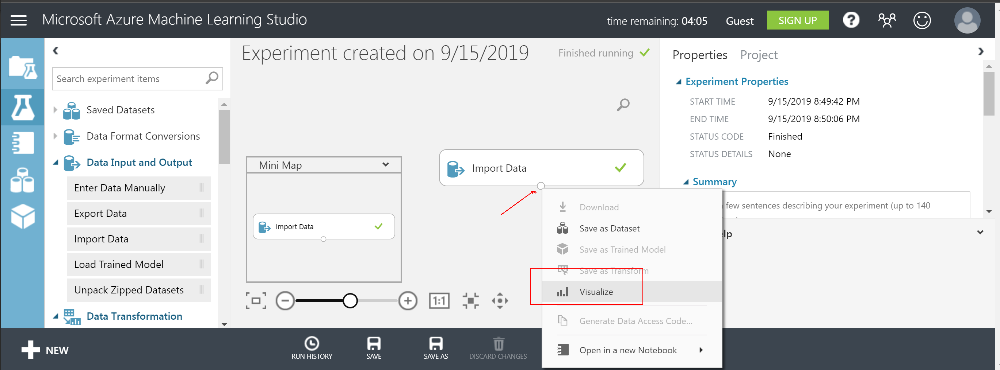
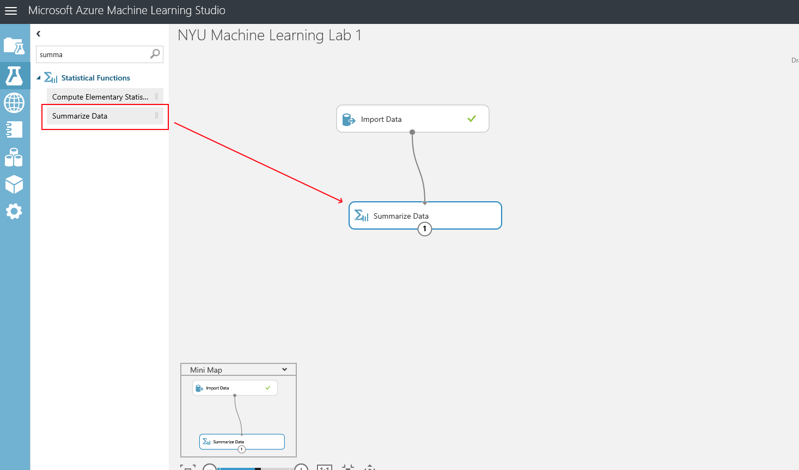
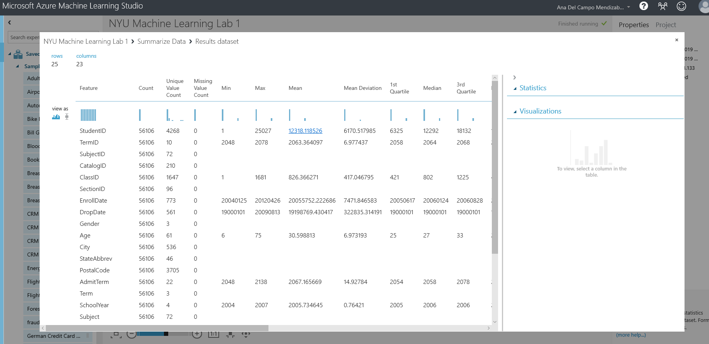

# Predictive Analytics for Business Analysts - Lab 1

## Learning Objectives

	• Establishing access to the cloud service, navigating the screens, reviewing and summarizing data. 
	• Designing and training a linear model, interpreting the output 
	
## Tasks
1. Establishing access to the cloud service	
1. Navigating the screens
1. Reviewing and summarizing data
1. Designing and training a linear model
1. Interpreting the output 

### Task 1: Establishing access to the cloud service

Navigate to [Azure Machine Learning Studio](https://studio.azureml.net/)

	

### Navigating the screens

#### Task 3: Reviweing and summarizing data
 
 ##### Create a Blank Experiment

1. No experiments will exists when you first log into Azure Machine Learning Studio.  At the lower left hand corner click on the **+ NEW** icon to create a new experiment:

1. When creating a new experiment you can choose templates from the [Azure AI Gallery](https://gallery.azure.ai/), run through a guided *Experiment Tutorial* or create a *Blank Experiment*.  Click on **Blank Experiment**:

1. A new *blank experiment* should be created.  On the left-hand side is a catigorical grouping of the machine learning modules available, along with a search window in the upper left that can be used to filter the modules:

##### Connect to Data Source

1. Type **sql** in the module search window and hit enter.  Drag and drop the **Import Data** module onto the experiment canvas:

1. The properties panel for the *Import Data* module should now be displayed on the right-hand side of the canvas.  Set the *Data source* to: **Azure SQL Database**

1. Continue to fill out the Azure SQL Database Properties using the values listed in the table:

    | Property | Value  |
    |------|------|
    |**Database server name**  | higheredu.database.windows.net|
    |**Database name**  | HigherED_DW|
    |**User name**  | utreader|
    |**Password**  | h00k'3mhornz|
    |**Accept any server certificate (insecure)**  | leave the box unchecked|
    |**Database query**  | SELECT * FROM MLInput.DropClass;|
    |**Use cached results**  | check the box|

    

1. Click on the **Save** icon at the bottom of the canvas to save the experiment.  Next, click on the **Run** icon at the bottom of the canvas and select **Run** to execute the modules included in the experiment.  

The *Experiment Properties* pane on the right-hand of the canvas should now show a *STATUS CODE* of **Running**:

A *green checkmark* will be displayed on the right-hand side of the *Import Data* module if the SQL statement was successfully run against the Azure SQL Database:

1. When building experiments modules can be connected to create a serialized execution pipeline.  Modules with **inputs** will have one or more *small circles* at the top of the module.  Modules with **outputs** will have one or more *small circles* at the bottom of the module.  Right-click on the *small circle* at the bottom of the *Import Data* module and select **Visualize**:

The *Results dataset* for the *Import Data* module should be displayed.  The visualization displays the number of rows and columns, sample data rows, descriptive statistics and attribute level distribution information:

##### Summarize Data

1. Type **summarize** in the module search window and hit enter.  Drag and drop the **Summarize Data** module onto the experiment canvas:

1. Click on the Save icon at the bottom of the canvas to save the experiment. Next, click on the Run icon at the bottom of the canvas and select Run to execute the modules included in the experiment.

1. You will be able to see the statistical information for the loaded dataset:
         max, min, media, mean,count, ext

	
## [Back to Syllabus](readme.md)

Further Reading
[Machine Learning WebServices](https://docs.microsoft.com/en-us/azure/machine-learning/studio/consume-web-services)
